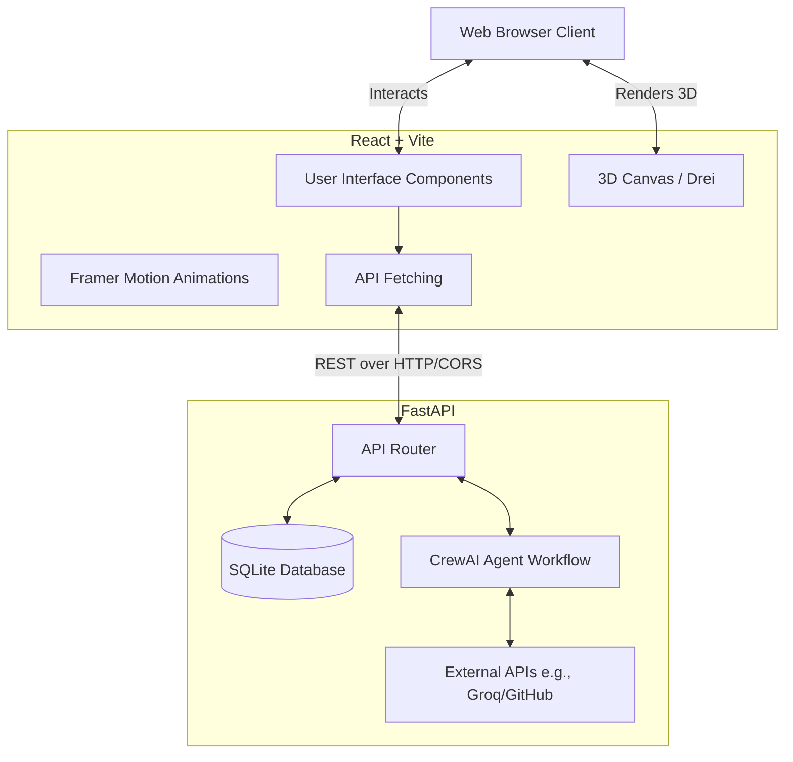

# Keshav Mishra - Portfolio & Engineering Platform


Welcome to the **Keshav Mishra Portfolio Platform**! This is a modular, service-oriented web platform built with a modern React frontend (powered by Vite and Three.js for 3D elements) and a FastAPI backend integrating AI capabilities via CrewAI.

---

##  Architecture Flow

The platform relies on a decoupled frontend and backend. Below is an interactive flowchart illustrating how the components communicate:



---

##  Features

| Feature | Description | Status |
| :--- | :--- | :---: |
| **Interactive 3D Scenes** | Integrates Three.js / React Three Fiber for immersive 3D graphics (e.g., Megatron Scene). | ✅ Live |
| **AI Assistant** | Powered by FastAPI and CrewAI to interact with users dynamically using Groq LLMs. | ✅ Live |
| **Modern UI/UX** | Built with Framer Motion and standard CSS/TSX for a responsive, sleek experience. | ✅ Live |
| **Command Palette** | Quick navigation tool for power users to navigate the platform seamlessly. | ✅ Live |
| **Docker Support** | Containerization for frictionless deployments across environments. | 🔜 Planned |

---

##  Technology Stack

| Category | Technology | Purpose |
| :--- | :--- | :--- |
| **Frontend Framework** | React 19 + Vite | Fast compilation and component-based UI. |
| **3D Rendering** | Three.js + React Three Fiber/Drei | WebGL graphics, glTF model loading, and 3D scenes. |
| **Animations** | Framer Motion | Smooth page transitions and element animations. |
| **Backend Framework** | FastAPI | High-performance, asynchronous REST API. |
| **AI Workflows** | CrewAI + Groq | Multi-agent workflows and high-speed LLM inference. |
| **Database** | SQLite | Lightweight embedded database for quick local setup. |

---

##  Project Structure

```text
d:\kfiles\portfolio\
├── backend/               # FastAPI Backend Service
│   ├── api/               # Route definitions and endpoints
│   ├── main.py            # FastAPI application entrypoint
│   └── requirements.txt   # Python dependencies
├── frontend/              # React + Vite Frontend
│   ├── src/
│   │   ├── components/    # Reusable UI & 3D Components
│   │   ├── pages/         # View pages (e.g., Landing)
│   │   └── App.tsx        # Main React application
│   └── package.json       # Node dependencies
├── portfolio.db           # SQLite database
├── start_backend.bat      # Windows backend quickstart
└── start_frontend.bat     # Windows frontend quickstart
```

---

##  Quickstart (Under 5 Minutes)

You can run the entire stack using the provided helper scripts or manually via terminal.

### Option 1: 1-Click Helper Scripts
For **Windows**:
```bat
# Start the backend API
start_backend.bat

# Start the frontend UI
start_frontend.bat
```

For **Mac/Linux**:
```bash
# Start the backend API
./start_backend.sh

# Start the frontend UI
./start_frontend.sh
```

---

### Option 2: Manual Setup

#### 1. Backend (FastAPI)
```bash
cd backend
python -m venv venv

# Windows
.\venv\Scripts\activate
# Mac/Linux
source venv/bin/activate

pip install -r requirements.txt
uvicorn main:app --reload
```
The backend API will run on `http://localhost:8000`

#### 2. Frontend (React + Vite)
```bash
cd frontend
npm install
npm run dev
```
The frontend UI will run on `http://localhost:5173`

---

##  Environment Variables
Copy `.env.example` to `.env` in the `backend/` directory:
```env
GROQ_API_KEY=your-api-key       # Required for the AI Chat Agent
GITHUB_TOKEN=optional-token     # Optional, increases API limits for GitHub stats
```

---

##  Future Enhancements
* **Docker Support**: A `docker-compose.yml` will be added in the future for deployment to containerized environments, but local development relies on `venv` and `npm` to keep the setup as lightweight as possible.